# Thought Process

## Approach

## All Statistical Values
We found the statistical values of all the columns as follows

|       | deltaX       | gamma        | omega        | flux         | pulse        | neutronCount  |
|-------|--------------|--------------|--------------|--------------|--------------|---------------|
| mean  | 95.209593    | 95.402143    | 95.016844    | 95.209804    | 95.209737    | 50541.730472  |
| std   | 103.796442   | 103.796594   | 103.797184   | 103.797320   | 103.796308   | 28578.459770  |
| min   | -211.728008  | -211.323966  | -211.882648  | -211.767355  | -211.500164  | 1000.000000   |
| 25%   | 39.445254    | 39.632531    | 39.242162    | 39.438783    | 39.449301    | 25810.000000  |
| 50%   | 114.096853   | 114.286186   | 113.906685   | 114.114242   | 114.092463   | 50604.000000  |
| 75%   | 175.434137   | 175.621276   | 175.241753   | 175.425143   | 175.434474   | 75257.000000  |
| max   | 286.705521   | 286.709571   | 286.513061   | 286.549948   | 286.466974   | 99999.000000  |


## Finding Volume

We started by finding the column corresponding to volume. This is because volume is expected to be an integer because it represents the number of shares traded that day which is a discrete value and it would have much different statistical values (mean, median, min, max, range and standard deviation) than the other columns.

Examining the Statical Table above, we observe the highly different values of all the statistical measures which significantly makes us determine that the column `neutronCount` corresponds to volume.

## Finding High and Low (bounds for a time unit)

Then we proceeded to calculate the bounds (low and high) from the data. To do this we came up with the idea of taking the minimum and maximum from each row and find the columns which give minimum and maximum for most of the values in the dataset after keeping aside the column for volume (`neutronCount`).

Frequency of each column being the ROW-WISE MAXIMUM:
| Column | Frequency  |
|--------|------------|
| gamma  | 432559     |
| pulse  | 67441      |

(others 0)

Frequency of each column being the ROW-WISE MINIMUM:
| Column | Frequency  |
|--------|------------|
| omega  | 432906     |
| pulse  | 67094      |

(others 0)

From the above tables, we infered that after keeping the column for volume (`neutronCount`) aside the values in the column `gamma` are the maximum for `432559` values which is the highest and thus we can very confidently suggest that `gamma` is indeed the maximum and maps to the actual column `high`.

Similarly, we consolidated the results for all the times each column is the minimum of all the columns for all values as shown in Table above and found that the column `omega` is lowest for most times `432906` and thus maps to the actual column `low`.

Also as we later found, if we kept gamma and omega as high and low during the candlestick analysis after finding open and close, they always contained open and close.

## Finding Price

Now we were left with three columns: `deltaX`, `flux` and `pulse`.

Assumption: Price could have meant many things (e.g. predicted price for a day, average price, etc.)

However, we observed an anomaly where the values in the `pulse` column occasionally reached both the maximum and minimum extremes, though not very frequently (as shown in Table (4?)). Meanwhile, the other two columns, `deltaX` and `flux`, consistently remained within the bounds defined by `gamma` (= high) and `omega` (= low).

This gave us a huge clue that `pulse` may be the price since it cannot be open or close because both open and close follow the following condition.

$$low <= open <= high$$
$$low <= close <= high$$

This means that price may be the predicted price or some other suitable such quantity. However it can be said with much confidence that `pulse` is not `open / close`. Hence, pulse needs to be `price`.

## Finding Open and Close

We were now left with only two columns and we had to determine which one is the opening share value (open) and which one is the closing share value (close).

Here we thought of using candlestick diagrams

## Hypothesis 1 (which we later deduce as correct)

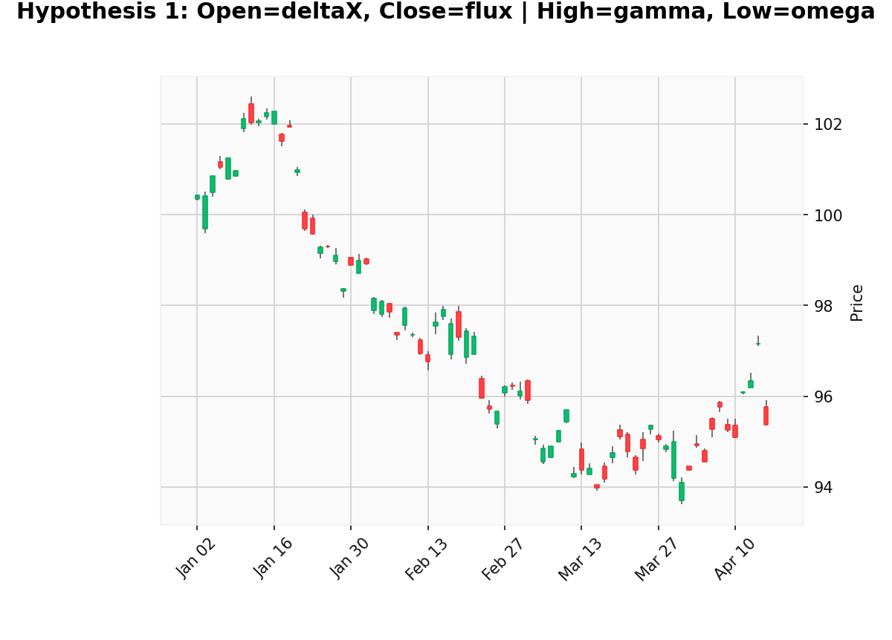
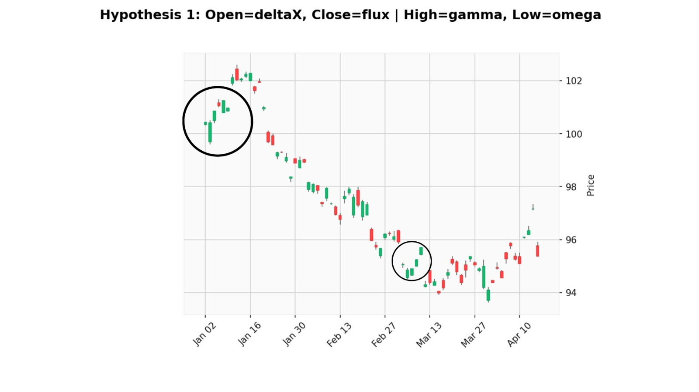

### Analysing one segment
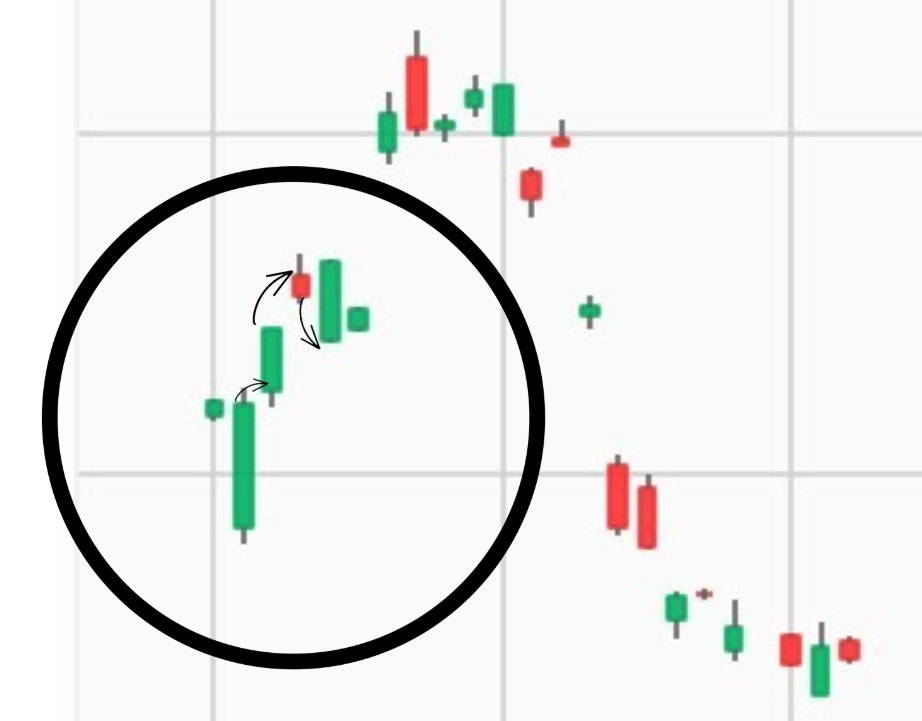

<\write the trend here>

### Analysing another segment
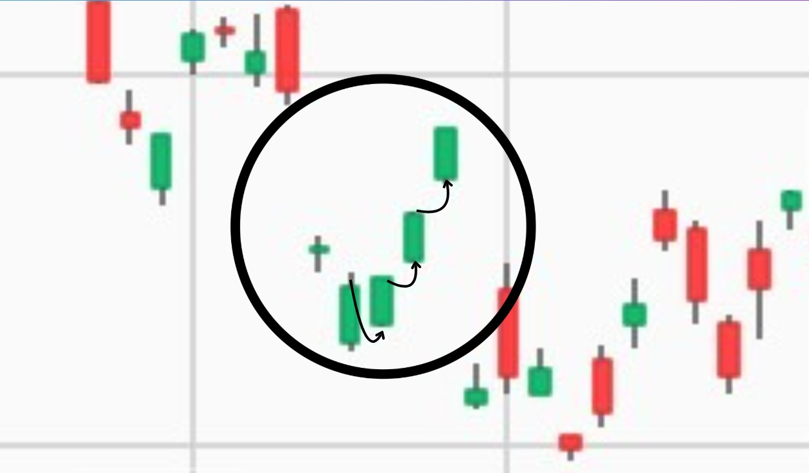

<\write the trend here>

## Hypothesis 2 (which we later deduce as incorrect)
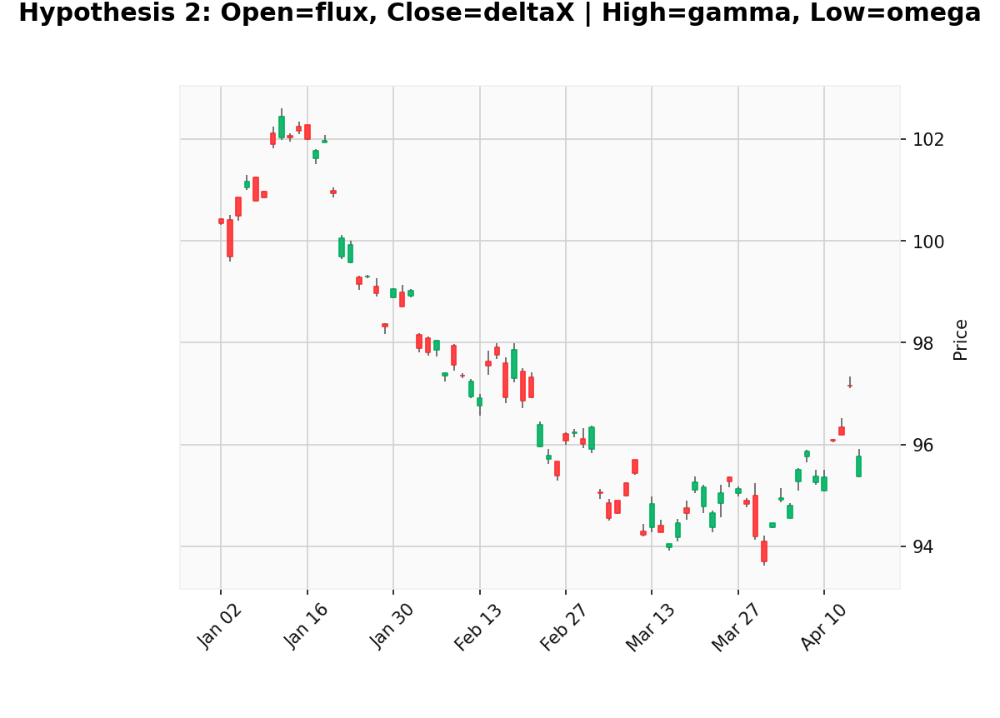
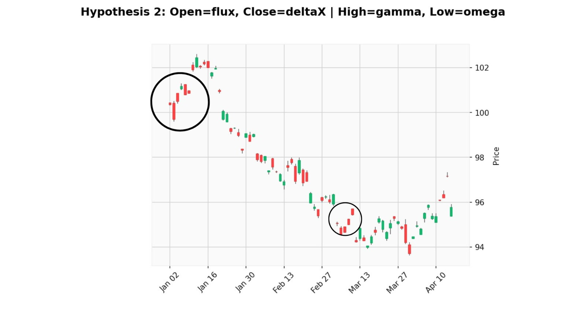

### Analysing one segment
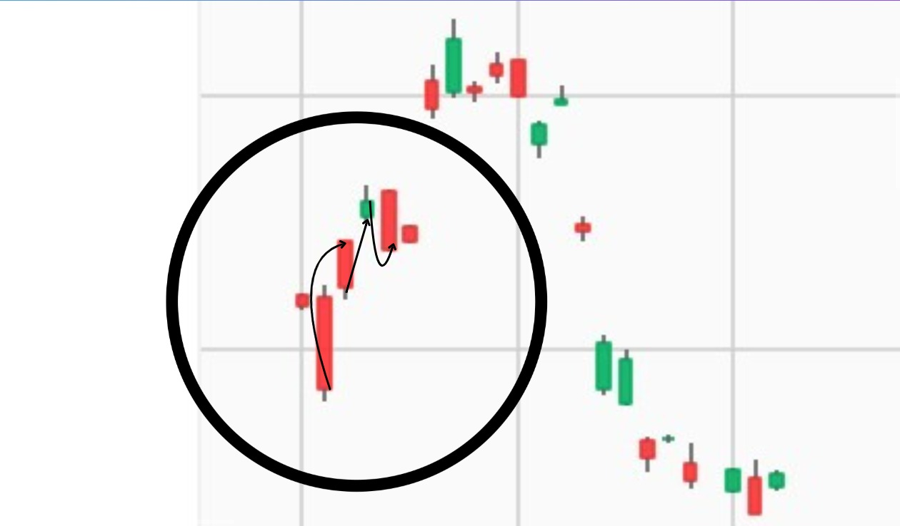

### Analysing another segment
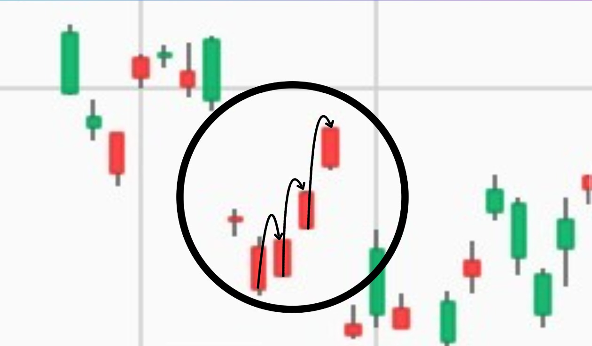

## We also employed to more methods to further check if the results obtained with the candlestick analysis are correct

These were
1. A Clever Regression model technique
2. A self-designed custom Sliding Window Dynamic Programming Algorithm

We have discussed these two methods in detail in the `analysis.ipynb` file.

### Challenges (and how we overcame them)
1. It was challenging to find an accurate way to map deltaX and flux to open and close. We overcame this by employing many methods:
   1. A custom self-devised definite sliding window algorithm to find the minimum differences across pairs and compute the most desirable pair (in order).
   2. Using a clever regression model technique.
   3. Candle Stick Analysis


# Confidence 
### **1. `neutronCount` → `volume`**

- `neutronCount` is always an integer and consistently has large magnitudes compared to other columns.
- `volume` is typically count-based integer and has much larger scale than price columns.
- **No violations or ambiguity observed.**

**Confidence: 1.0**
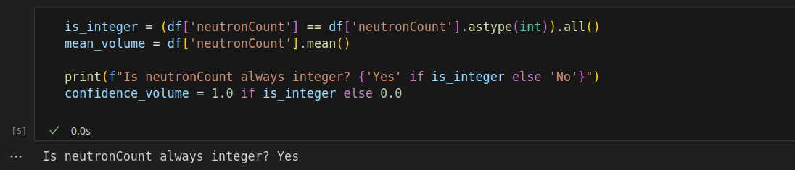

---

### **2. `gamma` → `high`**

- The `high` price must be the maximum value in each row.
- In 500,000 rows `gamma` is not the maximum in **67,441 rows**, meaning it satisfies the constraint in:

```
Correct rows = 500,000 - 67,441 = 432,559
Confidence = 432,559 / 500,000 = 0.8651
```

**Confidence: 0.8651**
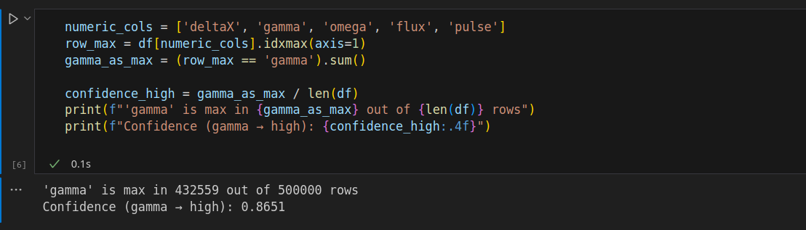

---

### **3. `omega` → `low`**

- The `low` price must be the **minimum value in each row**.
- `omega` is not the minimum** in **67,094 rows**, meaning it satisfies the constraint in:

```
Correct rows = 500,000 - 67,094 = 432,906
Confidence = 432,906 / 500,000 = 0.8658
```

**Confidence: 0.8658**
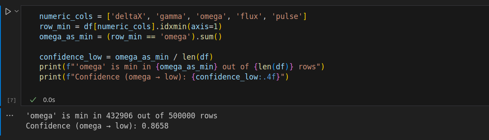

---

### **4. `pulse` → `price`**

- **Let A**: Event that `omega` is `low` and `gamma` is `high`.
- **Let B**: Event that `pulse` is `price`.


- **If B is true** (pulse is price), then it must always lie between low and high:
  - That means `omega = low` and `gamma = high` must be true ⇒ **A is necessarily true**.
  ```
  P(A | B) = 1
  ```

- **If A is true** (omega is low and gamma is high), then only `pulse` lies outside `[low, high]` range:
  - So, `pulse` **cannot** be `open` or `close`, which must lie within the range.
  - So it must be `price`.
  ```
  P(B | A) = 1
  ```

By **Bayes' Rule**:

```
P(B) = P(A)
```

Where:

```
P(A) = P(gamma is high ∧ omega is low)
     = actual observed count / total rows
     = 365,465 / 500,000 = 0.7309
```

**Confidence: 0.7309**
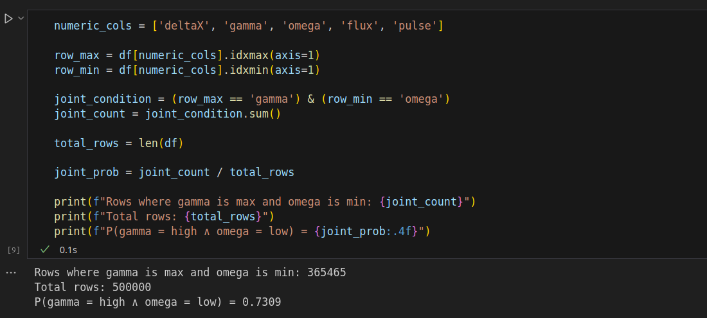

### **5. `deltaX` → `open`**
* We get the confidence interval of `deltaX` using the results of the regression and the sliding window model, as explained in the `analysis.ipynb` file

### **6. `flux` → `close`**
* Same as `deltaX` above


# Summary

Overall, we combined several methods including statical inference, visualisation, data analytics, and advanced algorithms like momentum regression and sliding window dynamic programming to derive the mapping. 
